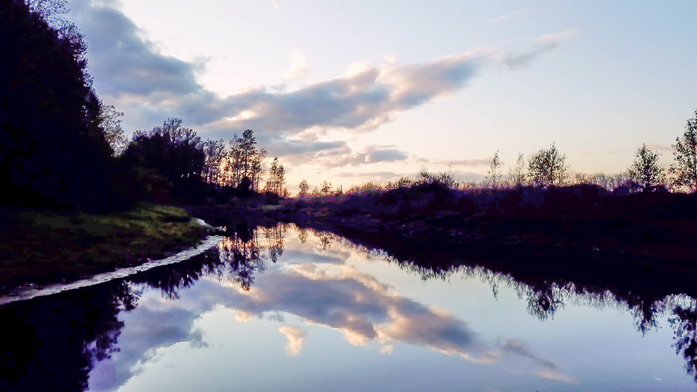
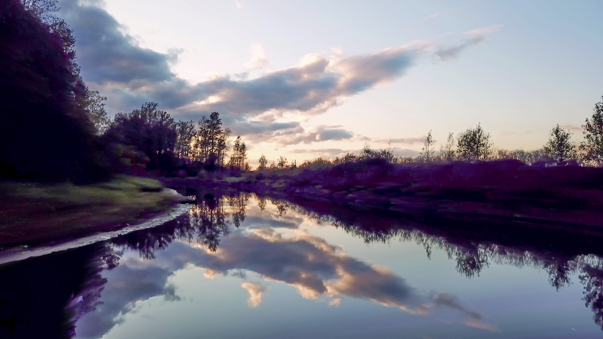

# ADDER-codec-rs
[](https://github.com/ac-freeman/adder-codec-rs/actions)
[](https://docs.rs/adder-codec-rs)
[](https://codecov.io/gh/ac-freeman/adder-codec-rs)
[](https://crates.io/crates/adder-codec-rs)
[](https://crates.io/crates/adder-codec-rs)


A unified framework for event-based video. Encoder/transcoder/decoder for ADΔER (Address, Decimation, Δt Event Representation) video streams. Includes a transcoder for casting framed video into an ADΔER representation in a manner which preserves the temporal synchronicity of the source, but enables many-frame intensity averaging on a per-pixel basis and extremely high dynamic range.


To enable the use of _source-modeled lossy compression_ (the only such scheme for event-based video, as far as I'm aware), install/import the relevant crates below with the `compression` feature enabled and the _nightly_ toolchain. For example, install adder-viz as follows:
```
cargo +nightly install adder-viz -F "compression"
```

To transcode from an iniVation DVS/DAVIS camera (using an older method, not yet unified with the Prophesee transcoder), enable the `open-cv` feature:
```
cargo +nightly install adder-viz -F "compression open-cv"
```

Source 8-bit image frame with shadows boosted ([source video](https://www.pexels.com/video/river-between-trees-2126081/))      |  Frame reconstructed from ADΔER events, generated from 48 input frames, with shadows boosted. Note the greater dynamic range and temporal denoising in the shadows.
:-------------------------:|:-------------------------:
  |  

## Included crates
- **adder-codec-rs**: ADΔER transcoders [[source](adder-codec-rs)] [](https://crates.io/crates/adder-codec-rs)
- **adder-codec-core**: core library [[source](adder-codec-core)] [](https://crates.io/crates/adder-codec-core)
- **adder-info**: tool for reading metadata of a .adder file [[source](adder-info)] [](https://crates.io/crates/adder-info)
- **adder-to-dvs**: tool for quickly converting a .adder file to a reasonable DVS representation in a text format [[source](adder-to-dvs)] [](https://crates.io/crates/adder-to-dvs)
- **adder-viz**: GUI application for transcoding framed and event (DVS/DAVIS) video to ADΔER, playing back .adder files, and visualizing the _many_ available ADΔER parameters [[source](adder-viz)] [](https://crates.io/crates/adder-viz)

## Other crates
- **davis-edi-rs**: a super high-speed system for performing frame deblurring and framed reconstruction from DAVIS/DVS streams, forming the backbone for the event camera driver code in the ADΔER library [[source](https://github.com/ac-freeman/davis-EDI-rs)] [](https://crates.io/crates/davis-edi-rs)
- **aedat-rs**: a fast AEDAT 4 Rust reader. [[source](https://github.com/ac-freeman/aedat-rs)] [](https://crates.io/crates/aedat)

## More information
Read [this paper](https://arxiv.org/abs/2401.17151) and the [wiki](https://github.com/ac-freeman/adder-codec-rs/wiki/) for background on ADΔER, how to use it, and what tools are included.

## Contributing

Several [open issues](https://github.com/ac-freeman/adder-codec-rs/issues) would greatly benefit from additional help! I've marked some as "good first issues" for new contributors. If you have any questions, please ask them on the issues page so others with similar questions can refer to our discussions. I will try to elucidate any confusing code or concepts with better documentation.

## Cite this work

If you write a paper which references this software, we ask that you reference the following papers on which it is based. Citations are given in the BibTeX format.

[An Open Software Suite for Event-Based Video](https://arxiv.org/abs/2401.17151)

**Note:** The code associated with this paper was released in [version 0.4.3](https://github.com/ac-freeman/adder-codec-rs/releases/tag/v0.4.3).

```bibtext
@misc{freeman2024open,
      title={An Open Software Suite for Event-Based Video}, 
      author={Andrew C. Freeman},
      year={2024},
      eprint={2401.17151},
      archivePrefix={arXiv},
      primaryClass={cs.MM}
}
```

[Accelerated Event-Based Feature Detection and Compression for Surveillance Video Systems](https://arxiv.org/abs/2312.08213)

**Note:** The code associated with this paper was released in [version 0.4.1](https://github.com/ac-freeman/adder-codec-rs/releases/tag/v0.4.1). This paper has been accepted for publication at MMSys '24.
```bibtext
@misc{freeman2023accelerated,
      title={Accelerated Event-Based Feature Detection and Compression for Surveillance Video Systems}, 
      author={Andrew C. Freeman and Ketan Mayer-Patel and Montek Singh},
      year={2023},
      eprint={2312.08213},
      archivePrefix={arXiv},
      primaryClass={cs.MM}
}
```

[An Asynchronous Intensity Representation for Framed and Event Video Sources](https://arxiv.org/abs/2301.08783)

**Note:** The code associated with this paper was released in [version 0.2.0](https://github.com/ac-freeman/adder-codec-rs/releases/tag/v0.2.0)
```bibtex
@inproceedings{10.1145/3587819.3590969,
author = {Freeman, Andrew C. and Singh, Montek and Mayer-Patel, Ketan},
title = {An Asynchronous Intensity Representation for Framed and Event Video Sources},
year = {2023},
isbn = {979-8-4007-0148-1/23/06},
publisher = {Association for Computing Machinery},
address = {New York, NY, USA},
url = {https://doi.org/10.1145/3587819.3590969},
doi = {10.1145/3587819.3590969},
booktitle = {Proceedings of the 14th ACM Multimedia Systems Conference},
pages = {1–12},
numpages = {12},
location = {Vancouver, BC, Canada},
series = {MMSys '23}
}
```

[The ADΔER Framework: Tools for Event Video Representations](https://dl.acm.org/doi/pdf/10.1145/3587819.3593028)
```bibtex
@inproceedings{Freeman23-0,
  title = {The ADΔER Framework: Tools for Event Video Representations},
  author = {Andrew C. Freeman},
  year = {2023},
  doi = {10.1145/3587819.3593028},
  url = {https://doi.org/10.1145/3587819.3593028},
  researchr = {https://researchr.org/publication/Freeman23-0},
  cites = {0},
  citedby = {0},
  pages = {343-347},
  booktitle = {Proceedings of the 14th Conference on ACM Multimedia Systems, MMSys 2023, Vancouver, BC, Canada, June 7-10, 2023},
  publisher = {ACM},
}
```

[Motion segmentation and tracking for integrating event cameras](https://dl.acm.org/doi/abs/10.1145/3458305.3463373)
```bibtex
@inproceedings{10.1145/3458305.3463373,
author = {Freeman, Andrew C. and Burgess, Chris and Mayer-Patel, Ketan},
title = {Motion Segmentation and Tracking for Integrating Event Cameras},
year = {2021},
isbn = {9781450384346},
publisher = {Association for Computing Machinery},
address = {New York, NY, USA},
url = {https://doi.org/10.1145/3458305.3463373},
doi = {10.1145/3458305.3463373},
abstract = {Integrating event cameras are asynchronous sensors wherein incident light values may be measured directly through continuous integration, with individual pixels' light sensitivity being adjustable in real time, allowing for extremely high frame rate and high dynamic range video capture. This paper builds on lessons learned with previous attempts to compress event data and presents a new scheme for event compression that has many analogues to traditional framed video compression techniques. We show how traditional video can be transcoded to an event-based representation, and describe the direct encoding of motion data in our event-based representation. Finally, we present experimental results proving how our simple scheme already approaches the state-of-the-art compression performance for slow-motion object tracking. This system introduces an application "in the loop" framework, where the application dynamically informs the camera how sensitive each pixel should be, based on the efficacy of the most recent data received.},
booktitle = {Proceedings of the 12th ACM Multimedia Systems Conference},
pages = {1–11},
numpages = {11},
keywords = {HDR, spike compression, image reconstruction, simulation, event cameras, object tracking, entropy encoding, motion segmentation, asynchronous systems},
location = {Istanbul, Turkey},
series = {MMSys '21}
}
```

[Integrating Event Camera Sensor Emulator](https://dl.acm.org/doi/10.1145/3394171.3414394)
```bibtex
@inproceedings{10.1145/3394171.3414394,
author = {Freeman, Andrew C. and Mayer-Patel, Ketan},
title = {Integrating Event Camera Sensor Emulator},
year = {2020},
isbn = {9781450379885},
publisher = {Association for Computing Machinery},
address = {New York, NY, USA},
url = {https://doi.org/10.1145/3394171.3414394},
doi = {10.1145/3394171.3414394},
abstract = {Event cameras are biologically-inspired sensors that upend the framed, synchronous nature of traditional cameras. Singh et al. proposed a novel sensor design wherein incident light values may be measured directly through continuous integration, with individual pixels' light sensitivity being adjustable in real time, allowing for extremely high frame rate and high dynamic range video capture. Arguing the potential usefulness of this sensor, this paper introduces a system for simulating the sensor's event outputs and pixel firing rate control from 3D-rendered input images.},
booktitle = {Proceedings of the 28th ACM International Conference on Multimedia},
pages = {4503–4505},
numpages = {3},
keywords = {asynchronous systems, image reconstruction, spike compression, event cameras, HDR, simulation},
location = {Seattle, WA, USA},
series = {MM '20}
}
```
